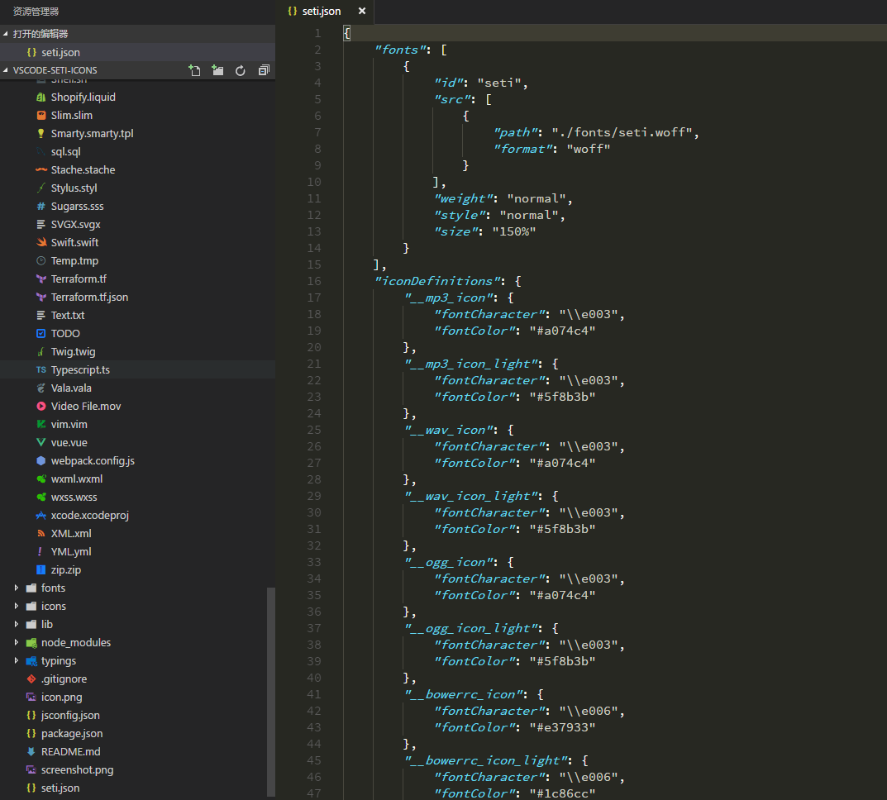

# seti-icons

Icons for VS Code (version 1.5.0+)

## usage 

    ## Installation

    1. Open the Command Palette (Press `F1` or `Ctrl+Shift+P`)
    2. Type "File Icon Theme"
    3. Select `Seti UI` from the list

    ## Applying Changes After Installation

    1. In the project root directory, run:
        ```bash
        node lib/icon.js
        ```
    2. Open the Command Palette (Press `F1` or `Ctrl+Shift+P`)
    3. Select `Developer: Reload Window`

## screenshot



## change log

- v0.1.3

 1. add icons for files(gulpfile.ts, webpack.config.babel.js)

- v0.1.2

 1. add icons for files(yarn.lock, .flowconfig)

- v0.1.1

 1. add icons for files(.wxml, .wxss)

- v0.0.9

 1. add icons for folders(src)

 2. add icons for files(webpack.config.js, .vim)

- v0.0.8 

 1. add icons for folders(.vscode, typings, node_modules, .git)

 2. add icons for files(.pem, .key, .fs, .zip, .rar, .xcodeproj, .vue)